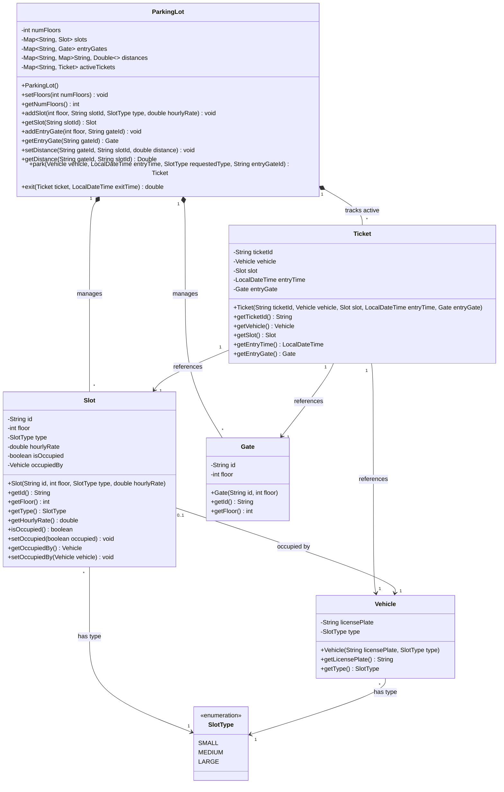
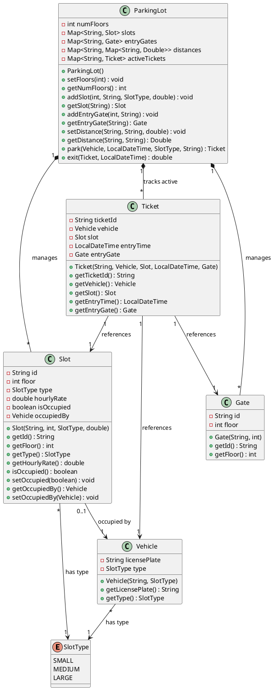

# Parking Lot System UML Diagram

This file documents the class diagram of the Parking Lot system in both **Mermaid** format (visualized automatically in GitHub, VS Code, and other Markdown viewers) and **PlantUML** format.

---

## 1. Mermaid Class Diagram

---

## 2. PlantUML Source Code

If you prefer to render using PlantUML tools, copy the code block below:

